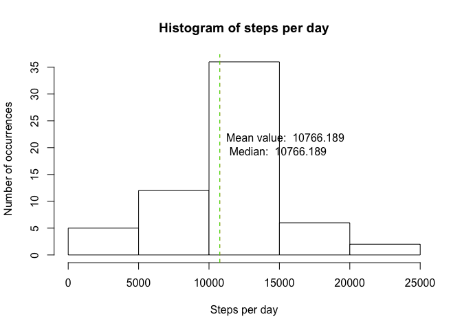

# Reproducible Research: Peer Assessment 1


## Loading and preprocessing the data

```r
download.file(url="https://d396qusza40orc.cloudfront.net/repdata%2Fdata%2Factivity.zip", destfile="download.zip")
unzip("download.zip")
raw_data<-read.csv("activity.csv",stringsAsFactors = FALSE)
```


## What is mean total number of steps taken per day?

```r
per_day<-aggregate(x=raw_data$steps,
                   list(raw_data$date),
                   sum)
names(per_day)<-c("Date","Total_Steps")
mean_per_day<-mean(per_day$Total_Steps,na.rm=TRUE)
median_per_day<-mean(per_day$Total_Steps,na.rm=TRUE)
hist(per_day$Total_Steps, 
     xlab="Steps per day",
     ylab="Number of occurrences",
     main="Histogram of steps per day",
     col="white",
     border="black")
abline(v=mean_per_day,lty="dashed",col="red")
abline(v=median_per_day,lty="dashed",col="green")
text(x=mean_per_day,
     y=20,
     labels=paste("Mean value: ",mean_per_day,"\n Median: ",median_per_day),
     pos=4)
```

<!-- -->

Mean is 1.0766189\times 10^{4}and median is 1.0766189\times 10^{4}

```r
mean(per_day$Total_Steps,na.rm=TRUE)
```

```
## [1] 10766.19
```
Median:

```r
median(per_day$Total_Steps,na.rm=TRUE)
```

```
## [1] 10765
```


## What is the average daily activity pattern?

```r
per_5_min<-aggregate(x=raw_data$steps,list(raw_data$interval),mean,na.rm=TRUE)
names(per_5_min)<-c("min_interval","Total_Steps")
plot(x=per_5_min$min_interval,y=per_5_min$Total_Steps,type="l")
max_interval=per_5_min$min_interval[
  which.max(per_5_min$Total_Steps)]
max_value=max(per_5_min$Total_Steps)
abline(v=max_interval,
       col="blue",
       lty="dashed")
text(x=max_interval,
     y=max_value-50,
     labels=paste("Max value: ",max_value,"\n At interval: ",max_interval),
     pos=4)
```

<!-- -->

Max average number of steps, 206.1698113, happens at 5 min interval 835

## Imputing missing values

Number of missing values in the set:

```r
sum(is.na(raw_data$steps))
```

```
## [1] 2304
```

Replace missing values with median for that interval

```r
na_vector=is.na(raw_data$steps)
replace_missing<-raw_data
replace_missing$steps[na_vector]<-per_5_min$Total_Steps[na_vector]
```

Now create the histogram with the replaced dataset


```r
per_day<-aggregate(x=replace_missing$steps,
                   list(replace_missing$date),
                   sum)
names(per_day)<-c("Date","Total_Steps")
#We can ommit the na.rm=TRUE, given that NA are replaced
mean_per_day<-mean(per_day$Total_Steps)
median_per_day<-mean(per_day$Total_Steps)
hist(per_day$Total_Steps, 
     xlab="Steps per day",
     ylab="Number of occurrences",
     main="Histogram of steps per day",
     col="white",
     border="black")
abline(v=mean_per_day,lty="dashed",col="red")
abline(v=median_per_day,lty="dashed",col="green")
text(x=mean_per_day,
     y=0,
     labels=paste("Mean value: ",mean_per_day,"\n Median: ",median_per_day),
     pos=4)
```

<!-- -->

Mean is NAand median is NA

```r
mean(per_day$Total_Steps,na.rm=TRUE)
```

```
## [1] 10766.19
```
Median:

```r
median(per_day$Total_Steps,na.rm=TRUE)
```

```
## [1] 10765.59
```


## Are there differences in activity patterns between weekdays and weekends?


```r
library(lubridate)
```

```
## 
## Attaching package: 'lubridate'
```

```
## The following object is masked from 'package:base':
## 
##     date
```

```r
replace_missing$Date<-ymd(replace_missing$date)
#Use wday to detect if is Weekend (1 or 6) or Weekday
replace_missing$day_type<-as.numeric(wday(replace_missing$date)==1 | wday(replace_missing$date)==6)
replace_missing$day_type=factor(replace_missing$day_type,levels=c("weekday","weekend"))
per_5_min_type<-aggregate(x=replace_missing$steps,
                          list(replace_missing$interval,
                               replace_missing$day_type),
                          mean,na.rm=TRUE)
names(per_5_min_type)<-c("min_interval","Total_Steps","Day type")
```
